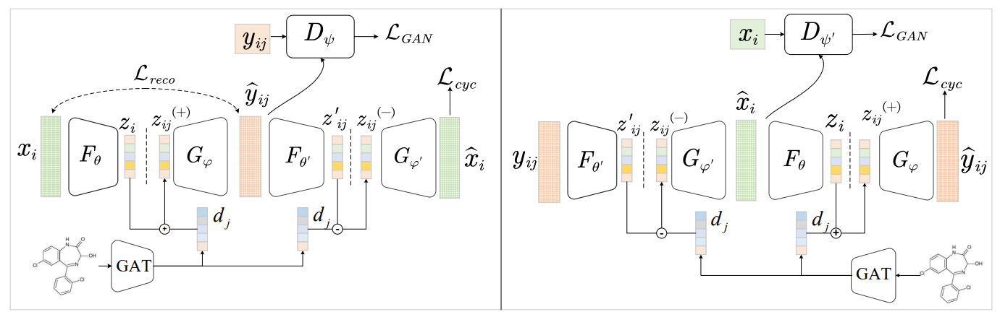

# Interpretable modeling of cellular responses to drug perturbations using cycle consistence learning

## Introduction

**cycleCDR** is tnterpretable modeling of cellular responses to drug perturbations using cycle consistence learning.

## Model architecture



## Requirements

The deep learning models were trained on 2*NVIDIA GeForce RTX 4090 on linux.

+ Python 3.11
+ PyTorch 2.0

## Usage

To setup the environment, install conda and run (Must run on servers with multiple GPUs):

```bash
conda create --name <your_env_name> --file requirements.txt
```

To train this model and obtain results, you need to download the dataset (Example: L1000), place it in the datasets folder, and then run:


```bash
torchrun --nproc_per_node=2 --master-port=29501  cycleCDR/linc_main.py
```

If you want to train other datasets, you need to modify the `cycleCDR/linc_main.py` section

## Directory structure

+ `cycleCDR`: contains the code for the model, the dataset, the evaluation, and the training loop.

+ `preprocessing`: Scripts for processing the data.

+ `configs`: Configuration file for hyperparameters.

+ `datasets`: Directory where data is stored.

+ `results`: This directory needs to be created by oneself. It is used to store the results of the experiment.

    + `modules`: Model storage directory.

    + `plot`: Training loss curve.

    + `plot_data`: Data of the training process.

